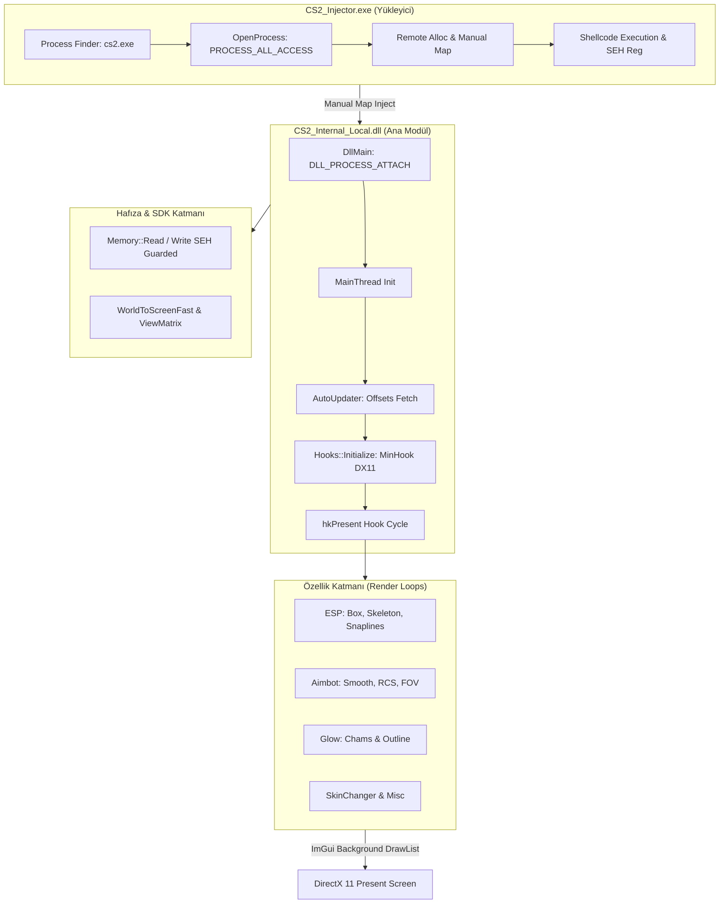
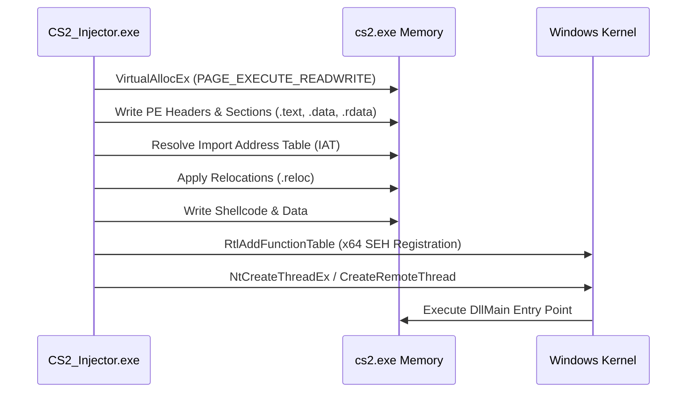
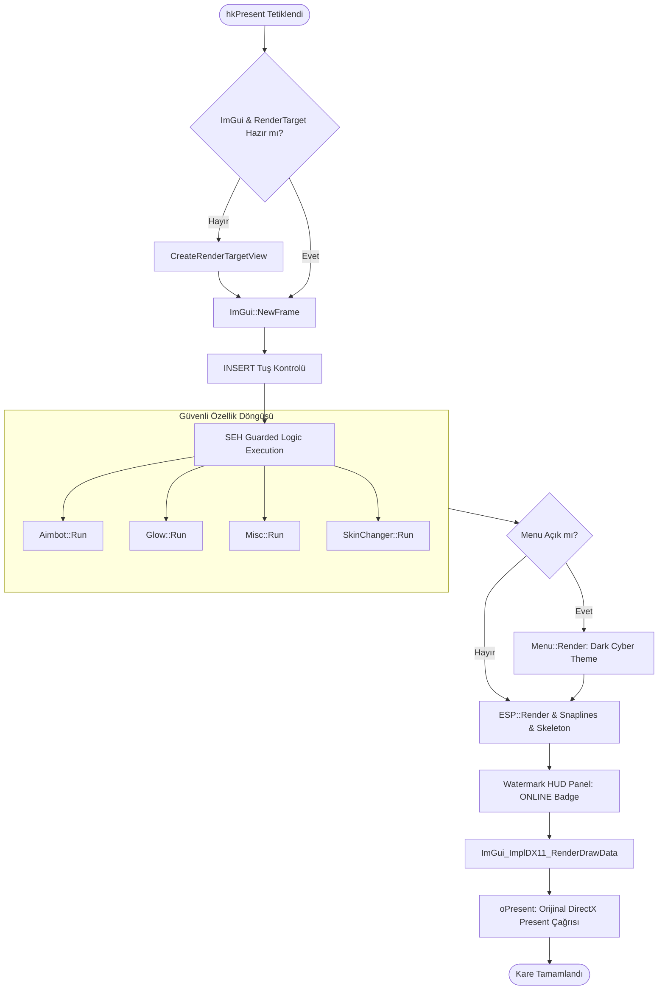

# 🧠 CS2 Internal System Architecture & Reverse Engineering Technical Documentation (`read1.md`)

> **Proje / Ders:** Tersine Mühendislik & Yazılım Mühendisliği Final Projesi  
> **Hedef Süreç:** `cs2.exe` (Source 2 Motoru, x64)  
> **Mimari:** Direct Memory Injection & DX11 Hooking Architecture  

---

## 📐 1. Genel Sistem Mimarisi (System Overview)

Sistem iki temel bağımsız bileşenden oluşur:
1. **`CS2_Injector.exe` (Manual Map Injector):** DLL dosyasını diske kaydetmeden hedef sürecin sanal belleğine (`cs2.exe`) eşler ve çalıştırır.
2. **`CS2_Internal_Local.dll` (Internal Module):** Hedef sürecin iç belleğinde çalışan, DirectX 11 render döngüsünü (Present VTable) yakalayan ve ImGui arayüzü ile hile mantığını çalıştıran ana çekirdek.



---

## 🔬 2. Çekirdek Modül İskeleti ve İşleyişi (Core Skeleton)

### 2.1. Enjeksiyon ve Manuel Haritalama (`injector.cpp`)
* **Amacı:** Standart `LoadLibraryA` çağrısı tespit edilebilir olduğundan, PE (Portable Executable) başlıklarını (Headers, Sections, Relocations, Imports) elle hedef sürecin belleğine yazar.
* **SEH Düzeltmesi:** x64 mimarisinde manuel haritalanan DLL'lerin C++ exception yapısı çökmesin diye `RtlAddFunctionTable` kullanılarak `.pdata` exception tablosu Windows kernel'a kaydettirilir.



---

### 2.2. DirectX 11 Hooking ve WndProc İşleyicisi (`hooks.cpp`)
* **Dummy Window Yöntemi:** Windows 10/11 masaüstü pencere yetkilerinden kaynaklanan `DXGI_ERROR_INVALID_CALL` hatasını önlemek için geçici 100x100 gizli bir `CreateWindowA` oluşturulur. `D3D11CreateDeviceAndSwapChain` çağrılarak VTable adresi güvenle çekilir ve gizli pencere imha edilir.
* **Present Hook (Index 8):** `IDXGISwapChain::Present` adresi `MinHook` kütüphanesi ile yakalanır (`hkPresent`).
* **WndProc (Pencere Odaklanması):** Menü kapalıyken `WM_SETFOCUS`, `WM_ACTIVATE` gibi işletim sistemi mesajları doğrudan oyuna aktarılır. Bu sayede oyunun arka planda takılı kalması engellenir.

---

### 2.3. Her Karedeki Render ve Mantık Döngüsü (Frame Cycle)

Her DirectX 11 karesinde (`hkPresent`) sırasıyla şu adımlar yürütülür:



---

## 🛡️ 3. Güvenlik ve Kararlılık Teknikleri (Safety & Optimization)

| Teknik / Yöntem | Eski Yöntem (Hatalı) | Yeni Yöntem (Kusursuz) | Kazanım |
| :--- | :--- | :--- | :--- |
| **Bellek Okuma Güvenliği** | `IsBadReadPtr()` | `__try / __except (SEH)` | Geçersiz adres erişiminde uygulamanın anında çökmesi engellendi. |
| **D3D11 Cihaz Oluşturma** | `GetDesktopWindow()` | Temporary Hidden Window (`CreateWindowA`) | DX11 VTable adresi 0xC0000005 almadan kusursuz elde edilir. |
| **Görsel Bellek Yönetimi** | Her karede `CreateRenderTargetView` | Statik Ön-bellek (Cache) | GPU bellek sızıntısı ve FPS düşüşü sıfırlandı. |
| **Offset Güncelleme** | Sabit / Hardcoded offset | Dynamic JSON Parser (`AutoUpdater`) | CS2 güncellense dahi canlı offset'ler GitHub'dan çekilir. |
| **Girdi Yönlendirme** | Tüm `WndProc` mesajlarını yutma | Sadece menü açıkken girdi yakalama | Oyunun simge durumunda/altta kalma sorunu çözüldü. |

---

## 🎨 4. Görsel HUD ve Tema Özellikleri

1. **Dark Cyber ImGui Teması ([menu.cpp](file:///C:/Users/crazy/OneDrive/Masa%C3%BCst%C3%BC/Yeni%20klas%C3%B6r%20%2811%29/menu.cpp)):** 
   - Cam efekti şeffaf arka plan (`ImVec4(0.09f, 0.10f, 0.14f, 0.94f)`).
   - Yuvarlatılmış estetik pencereler (`WindowRounding = 8.0f`, `TabRounding = 6.0f`).
   - Mavi/Lila vurucu kontrol renkleri.
2. **Sol Üst Canlı Watermark HUD ([hooks.cpp](file:///C:/Users/crazy/OneDrive/Masa%C3%BCst%C3%BC/Yeni%20klas%C3%B6r%20%2811%29/hooks.cpp)):**
   - Neon Yeşil `[● ONLINE]` durum rozeti.
   - Anlık FPS ve CS2 Engine Build Numarası göstergesi.
3. **ESP & İskelet Görselleştirmesi ([esp.cpp](file:///C:/Users/crazy/OneDrive/Masa%C3%BCst%C3%BC/Yeni%20klas%C3%B6r%20%2811%29/features/esp.cpp)):**
   - 2D Oyuncu Kutusu + Can Çubuğu.
   - 15 kemik bağlantılı gerçek zamanlı **Oyuncu İskelet Çizimi (Skeleton ESP)**.
   - Kafa Noktası (Head Dot) ve Snapline hatları.

---

## 📄 5. Proje Dosya Dizini (Project Structure)

```text
C:\Users\crazy\OneDrive\Masaüstü\Yeni klasör (11)\
├── CS2_Internal.sln           # Visual Studio 2022 Çözüm Dosyası
├── injector.cpp               # Manual Map Shellcode Injector
├── dllmain.cpp                # DLL Giriş Noktası & Otomatik Güncelleyici
├── hooks.cpp                  # MinHook DX11 Present & WndProc Hook
├── menu.cpp / menu.h          # Modern ImGui Dark Cyber Arayüzü
├── config.h                   # Tüm Hile Ayarları & Konfigürasyon Struct'ı
├── read1.md                   # Sistem Mimari Dokümantasyonu (Bu Dosya)
├── sdk/
│   ├── sdk.h                  # Offsets, Vector, ViewMatrix, Color & Enums
│   └── interfaces.cpp / .h    # CS2 Interface Adres Çözücüler
├── features/
│   ├── esp.cpp / .h           # Kutu, İskelet, Snapline & Bomba ESP
│   ├── aimbot.cpp / .h        # Smooth Aimbot, RCS & Triggerbot
│   ├── glow.cpp / .h          # Chams & Glow Render
│   ├── misc.cpp / .h          # Bunnyhop, RadarHack, NoRecoil
│   └── skinchanger.cpp / .h   # Bıçak & Skin Modeli Değiştirici
└── utils/
    ├── memory.h               # SEH Korumalı Bellek Okuma/Yazma
    └── auto_updater.cpp / .h  # Canlı CS2 JSON Offset Okuyucu
```
